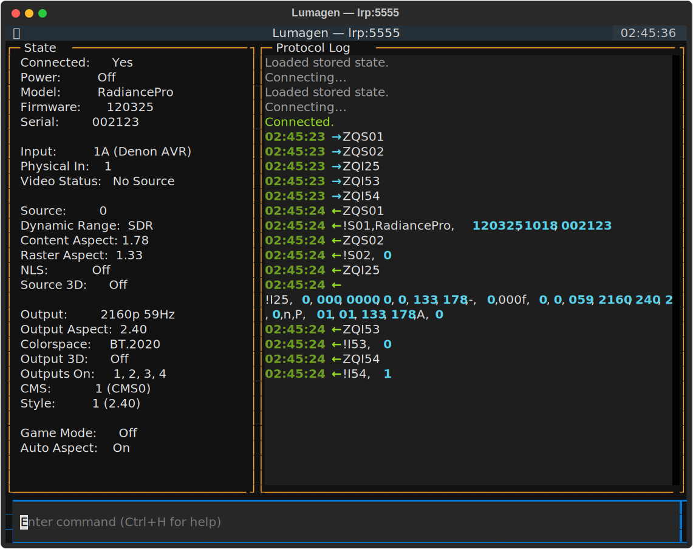

# Lumagen Radiance Pro Integration for Home Assistant

This integration connects your Lumagen Radiance Pro video processor to your Home Assistant installation.

## TCP/IP to Serial Adapter Setup

Required: A TCP/IP to Serial adapter such as the [Global Cache iTach IP2SL](https://www.amazon.com/Global-Cache-iTach-Serial-IP2SL/dp/B0051BU1X4) or [USR-TCP232-302](https://www.amazon.com/USR-TCP232-302-Serial-Ethernet-Converter-Support/dp/B01GPGPEBM)\* connected to the Lumagen's RS-232 port.

Connect the adapter to the Lumagen's RS-232 DB-9 male DTE port using the appropriate cable:

- The IP2SL has a DB-9 male DTE port. Connect it using a [DB-9 female-to-female null-modem cable](https://www.startech.com/en-us/cables/scnm9ff1mbk).
- The USR-TCP232-302 has a DB-9 female DCE port. Connect it using a [DB-9 male-to-female straight-through cable](https://www.startech.com/en-us/cables/mxt1001mbk).

The adapter's serial port settings must match the Lumagen's RS-232 port settings (default: 9600 bps, 8N1, no flow control).

Connect the adapter to your local network. You'll need the adapter's IP address and port (default 4999) when configuring the integration later.

\* *This integration is developed and tested against the USR-TCP232-302.*

## Lumagen Setup

The Lumagen should be configured as follows for the integration to work correctly.

1. **MENU → Other → I/O Setup → RS-232 Setup:**
   - **Echo-RS232**: On (Lumagen recommends "On". If set to "Off" it may affect the ability to do software updates. *This integration should work either way, but is tested with it On.*)
   - **Echo-USB**: On (Lumagen recommends "On". If set to "Off" it may affect the ability to do software updates. *Mentioned only for completeness as the TCP/IP to serial adapter connects to the RS-232 port.*)
   - **Delimiters**: Off (Lumagen recommends "Off". This works reliably and is easier to implement.  *This integration WILL NOT work unless Delimiters=Off.*)
   - **Report mode changes**: Full v5 (Optional but recommended. *Enables the integration to receive real-time updates from the Lumagen.*)
2. **MENU → Other → OnOff Setup:**
    - **On Message**: N (Message may interfere with integration.)
    - **Off Message**: N (Message may interfere with integration.)
3. **MENU → Input → Options → Aspect Setup:**
   - **Aspect Opts**: Extended (Optional but recommended. Enables detection/selection of 4:3 Pillarbox, 1.375 Pillarbox, 1.66 Pillarbox, 2.10, 2.55, and 2.76 aspect ratios.)

## Installation

### HACS

1. Install [HACS](https://hacs.xyz)
2. Open HACS → Integrations
3. Three-dot menu → Custom repositories
4. Add this repository's URL, category "Integration"
5. Install this integration and restart Home Assistant

### Manual

Copy `custom_components/ha_lumagen` into your Home Assistant `custom_components` directory and restart.

## Configuration

1. Settings → Devices & Services → Add Integration → Lumagen
2. Enter the hostname (or IP address) and port (default: 4999) of your TCP/IP to Serial Adapter.

*Note: The integration tests the connection before completing setup.*

## Entities

### Switches

| Entity       | Description |
|--------------|-------------|
| Power        | Turn device on / standby. Available even in standby. |
| Auto Aspect  | Enable / disable auto aspect detection. Syncs with aspect ratio selection (see below). |

### Buttons

| Entity             | Category      | Description |
|--------------------|---------------|-------------|
| Reset auto aspect  | Main controls | Reset auto aspect detection and re-enable it (ZY550). Also clears NLS. |
| Show input aspect  | Main controls | Pop up input and aspect info on the Lumagen OSD. |
| Reload config      | Configuration | Re-fetch identity and all labels from the device and save to disk. |

### Selects

| Entity       | Description |
|--------------|-------------|
| Input        | Select from labeled inputs. Labels are cached on disk; press Reload Config to update. |
| Aspect Ratio | Auto, 1.33, Letterbox, 1.78, 1.85–2.76, plus NLS variants (see below). |
| Memory       | Select input memory A / B / C / D. |

### Sensors

All sensors require the device to be active (not in standby).

| Sensor                       | Description |
|------------------------------|-------------|
| Logical Input                | Current logical input number |
| Physical Input               | Current physical input |
| Input Configuration          | Active input config number |
| Input Video Status           | No Source / Active Video / Test Pattern |
| Source Resolution             | Source vertical resolution |
| Source Refresh Rate           | Source vertical refresh rate |
| Source Content Aspect Ratio   | Detected source content aspect |
| Source Raster Aspect Ratio    | Source raster aspect |
| Source Dynamic Range          | SDR / HDR |
| Source Mode                   | Progressive / Interlaced |
| Source 3D Mode                | Off / Frame Sequential / Frame Packed / Top-Bottom / Side-by-Side |
| NLS Active                   | Non-linear stretch active |
| Detected Content Aspect Ratio | Auto-detected content aspect (v4+ firmware) |
| Detected Raster Aspect Ratio  | Auto-detected raster aspect (v4+ firmware) |
| Output Resolution             | Output vertical resolution |
| Output Refresh Rate           | Output vertical refresh rate |
| Output Aspect Ratio           | Output aspect ratio |
| Output Mode                   | Progressive / Interlaced |
| Output Colorspace             | Output colorspace (e.g. BT.709, BT.2020) |
| Output 3D Mode                | Off / Frame Sequential / Frame Packed / Top-Bottom / Side-by-Side |
| Active Outputs                | Which outputs are active (1–4) |
| Output CMS                    | Active color management system (0–7) |
| Output Style                  | Active output style (0–7) |

Device identity (model, serial, firmware) is shown in HA's device info
rather than as separate entities.

### Remote

Send navigation and control commands to the Lumagen menu system.

Available commands: `up`, `down`, `left`, `right`, `menu`, `ok`, `enter`,
`exit`, `back`, `home`, `info`, `alt`, `clear`, `previous`, `pip_off`,
`pip_select`, `pip_swap`, `pip_mode`, `save`, `hdr_setup`, `test_pattern`,
`osd_on`, `osd_off`, `0`–`9`.

## Aspect Ratio and Auto Aspect

The Aspect Ratio select and Auto Aspect switch are kept in sync:

| Action              | Auto Aspect | NLS    | Aspect              |
|---------------------|-------------|--------|---------------------|
| Select "Auto"       | On          | Off    | (device-detected)   |
| Select a ratio      | Off         | Off    | Set to selection    |
| Select NLS variant  | Off         | On*    | Set to base ratio   |
| Reset Auto Aspect   | On          | Off    | (device-detected)   |

### NLS (Non-Linear Stretch)

NLS stretches a narrower aspect to fill a wider display non-linearly (more stretch at the edges, less in the center). The integration offers three NLS variants:

- **1.33 NLS** — stretch 1.33 (4:3) to 1.78 (16:9)
- **1.78 NLS** — stretch 1.78 (16:9) to 2.35/2.40
- **1.85 NLS** — stretch 1.85 to 2.35/2.40

On the Lumagen remote, NLS is a two-button sequence (e.g. press 1.78 then NLS). The integration sends both commands automatically.

\* **Caveat:** NLS behavior can be unreliable at the firmware level. In testing, 1.33 NLS and 1.78 NLS work consistently, but **1.85 NLS works roughly 50% of the time** — the device sometimes sets the aspect to 1.85 without engaging NLS. This is a firmware limitation. The integration queries the device for authoritative state after sending NLS commands, so the UI will always show what the device actually did.

## Usage Examples

### Power

```yaml
action: switch.turn_on
target:
  entity_id: switch.lumagen_radiancepro_power
```

### Input Selection

```yaml
action: select.select_option
target:
  entity_id: select.lumagen_radiancepro_input
data:
  option: "HDMI 1"
```

### Aspect Ratio

```yaml
action: select.select_option
target:
  entity_id: select.lumagen_radiancepro_aspect_ratio
data:
  option: "2.35"
```

### Remote Commands

```yaml
action: remote.send_command
target:
  entity_id: remote.lumagen_radiancepro_remote
data:
  command:
    - menu
    - down
    - enter
```

### Services

The integration registers domain-level services for OSD control:

| Service                      | Description |
|------------------------------|-------------|
| `ha_lumagen.display_message` | Show an OSD message (up to 60 chars, two 30-char lines). Set `block_char: true` to render `X` as █. |
| `ha_lumagen.display_volume`  | Show a volume bar (0-100) for 1 second, scaled for a 0-80 useful range. |
| `ha_lumagen.clear_message`   | Clear any OSD message. |

```yaml
# Show a custom message for 5 seconds
action: ha_lumagen.display_message
data:
  message: "Hello World"
  duration: 5

# Show a volume bar
action: ha_lumagen.display_volume
data:
  volume: 63.5
```

### Automation Examples

#### Switch input on playback

```yaml
automation:
  - alias: "Switch to Apple TV"
    trigger:
      - platform: state
        entity_id: media_player.apple_tv
        to: "playing"
    action:
      - action: select.select_option
        target:
          entity_id: select.lumagen_radiancepro_input
        data:
          option: "HDMI 2"
```

#### Show Denon AVR volume on the Lumagen OSD

If you use a Denon/Marantz AVR with the [built-in HA integration](https://www.home-assistant.io/integrations/denonavr/), you can mirror volume changes on the Lumagen display — no separate daemon needed:

```yaml
- alias: "Show Denon volume on Lumagen"
  triggers:
    - trigger: state
      entity_id: media_player.denon_avr_x3800h  # adjust to your entity
      attribute: volume_level
  conditions:
    # Skip when volume_level is None (e.g. AVR powering on/off)
    - condition: template
      value_template: "{{ trigger.to_state.attributes.volume_level is not none }}"
  actions:
    - action: ha_lumagen.display_volume
      data:
        volume: "{{ trigger.to_state.attributes.volume_level * 100 }}"
  mode: single
```


## Troubleshooting

### Connection fails during setup

- Verify the TCP/IP-to-serial adapter is reachable at the configured IP/port
- Confirm the adapter's serial settings match the Lumagen's (9600 8N1)
- Try with the Lumagen powered on. It may not respond if its standby power is configured to "Lowest".

### Entities show unavailable

- Sensors require the device to be active (not in standby)
- Power switch and Reload Config are available whenever connected
- Check Home Assistant logs for keepalive timeouts or reconnect messages

### Input source dropdown shows "Input 1", "Input 2", …

Labels are cached on disk. If you see default names:
1. Confirm you have custom labels configured on the Lumagen
2. Press the **Reload config** button entity to fetch labels from the device
3. Labels are per input memory — switching memories shows that memory's labels

### NLS aspect shows unexpected result

NLS can be unreliable at the firmware level (see [NLS caveats](#nls-non-linear-stretch) above). The integration always queries the device for authoritative state after NLS commands, so the UI reflects what the device actually did.

### TUI

A standalone Textual TUI for exercising the client against a real Lumagen:

```bash
./tui.py <host> [port]
# or via env vars:
LUMAGEN_HOST=lrp LUMAGEN_PORT=5555 ./tui.py
```


